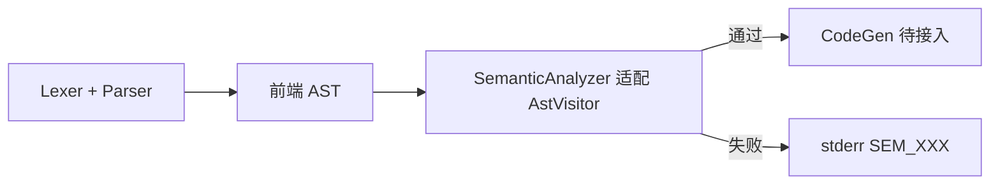

# ToyC 语义分析集成指南

本文档说明如何将成员 B 的语义分析模块接入当前前端（见 [FrontEnd.md](./FrontEnd.md)）。

**集成原则**：B 侧 `SemanticAnalyzer` 适配前端的类名与 `AstVisitor`。

---

## 1. 总体分工

| 阶段 | 目标 | 主要改动方 |
|------|------|-----------|
| **P2** | B 的 `SemanticAnalyzer` 能遍历前端 AST，完成 15 类语义检查 | **B 为主**（改 visitor 与节点访问代码）；A 可选加别名/薄适配 |
| **P3** | 四模块代码合并构建，`main` 串联流水线，跑通 `tests/semantic/` | **A + B 协作**（`main.cpp`、`CMakeLists.txt`、错误输出） |



---

## 2. P2：AST / 接口对齐

### 2.1 节点与字段命名对照表

B 的 [Semantic.md](./Semantic.md) 基于独立 `AST.h` 编写；合并时必须按下列映射访问**前端**接口：

| Semantic.md（B 旧名） | 前端（A 当前名） | 访问方式 | 备注 |
|----------------------|-----------------|---------|------|
| `ASTNode::line` | `AstNode::line()` | `node.line()` | 或直接 `node.location().line` |
| `ASTNode::column` | `AstNode::column()` | `node.column()` | |
| `CompUnit::elements` | `CompUnit::items()` | `for (const auto& item : cu.items())` | 元素为 `variant<unique_ptr<VarDecl>, ...>` |
| `Block` | `BlockStmt` | `visit(const BlockStmt&)` | 语句列表：`node.stmts()` |
| `Number` | `IntLiteral` | `visit(const IntLiteral&)` | `node.value()` |
| `Identifier` / `ID` | `IdentifierExpr` | `visit(const IdentifierExpr&)` | `node.name()` |
| `FuncCall` | `CallExpr` | `visit(const CallExpr&)` | `node.is_statement()` 对应 `isStatement` |
| `FuncDef::returnType` | `FuncDef::return_type()` | 返回 `Type*` | 使用 `Type::intType()` / `voidType()` |
| `VarDecl::initExpr` | `VarDecl::init_expr()` | 同 `init()` | |
| `VarDecl::isGlobal` | `VarDecl::is_global()` | `bool` | |
| `ConstDecl::initExpr` | `ConstDecl::init_expr()` | 同 `init()` | |
| `ConstDecl::isGlobal` | `ConstDecl::is_global()` | `bool` | |
| `AssignStmt::lvalue` | `AssignStmt::lvalue()` | `const IdentifierExpr&` | `node.name()` 为便捷别名 |
| `Expr::type` | `Expr::type()` / `set_type()` | `Type*` | 语义阶段可写入 |
| `ASTVisitor` | `AstVisitor` | 见 §2.2 | 头文件：`ast/AstVisitor.h` |

**前端独有、B 必须处理的节点：**

| 节点 | 处理方式 |
|------|---------|
| `DeclStmt` | `visit(DeclStmt)` 内转发：`node.decl().accept(*this)` |
| `EmptyStmt` | `visit(EmptyStmt)` 空实现或跳过 |
| `ReturnStmt` 无返回值 | `node.has_value()` 为 `false` 时表示 `return;`（void 函数） |

### 2.2 `AstVisitor` 方法签名

B 的 `SemanticAnalyzer`（或其内部访问者）应 `#include "ast/AstVisitor.h"` 并实现以下全部纯虚函数：

```cpp
class SemanticAnalyzer : public AstVisitor {
public:
    void visit(const CompUnit& node) override;
    void visit(const VarDecl& node) override;
    void visit(const ConstDecl& node) override;
    void visit(const FuncDef& node) override;
    void visit(const Param& node) override;
    void visit(const BlockStmt& node) override;
    void visit(const EmptyStmt& node) override;
    void visit(const ExprStmt& node) override;
    void visit(const AssignStmt& node) override;
    void visit(const DeclStmt& node) override;      // B 旧代码可能没有，必须新增
    void visit(const IfStmt& node) override;
    void visit(const WhileStmt& node) override;
    void visit(const BreakStmt& node) override;
    void visit(const ContinueStmt& node) override;
    void visit(const ReturnStmt& node) override;
    void visit(const BinaryExpr& node) override;
    void visit(const UnaryExpr& node) override;
    void visit(const IntLiteral& node) override;
    void visit(const IdentifierExpr& node) override;
    void visit(const CallExpr& node) override;
};
```

**B 侧 rename 清单（全文搜索替换建议）：**

| 旧代码 | 改为 |
|--------|------|
| `#include "ast/AST.h"` | `#include "ast/CompUnit.h"` 等分拆头文件，或统一 `#include "ast/AstVisitor.h"` + 各节点头 |
| `ASTVisitor` | `AstVisitor` |
| `Number` | `IntLiteral` |
| `Identifier` | `IdentifierExpr` |
| `FuncCall` | `CallExpr` |
| `Block` | `BlockStmt` |
| `node.elements` | `node.items()` + `std::visit` |
| `node.statements` | `node.stmts()` |
| `call.isStatement` | `call.is_statement()` |
| `decl.isGlobal` | `decl.is_global()` |
| `assign.lvalue`（字符串） | `assign.lvalue().name()` 或整个 `assign.lvalue()` |
| `using namespace toyc;` | 可删除（前端无此命名空间） |

### 2.3 `SemanticAnalyzer` 公共接口对齐

B 文档中的对外接口保持不变，仅 **`analyze` 参数类型**需与前端一致：

| 接口 | Semantic.md 写法 | 合并后推荐签名 | 说明 |
|------|-----------------|----------------|------|
| 分析入口 | `analyze(cu.get())` | `bool analyze(const CompUnit& root)` | 推荐引用；也可 `analyze(CompUnit* root)` |
| 错误列表 | `errors()` | `const std::vector<SemanticError>& errors() const` | 不变 |
| 全局查符号 | `lookupGlobal(name)` | `Symbol* lookupGlobal(const std::string& name)` | 不变 |
| 局部查符号 | `lookupLocal(name)` | `Symbol* lookupLocal(const std::string& name)` | 不变 |
| 常量查询 | `getConstantValue(name, &val)` | 签名不变 | 供 C/D 使用 |

**建议 B 在头文件中声明：**

```cpp
// src/semantic/SemanticAnalyzer.h
#pragma once

#include "ast/CompUnit.h"
#include "semantic/errors.h"

class Symbol;

class SemanticAnalyzer {
public:
    bool analyze(const CompUnit& root);

    const std::vector<SemanticError>& errors() const;
    Symbol* lookupGlobal(const std::string& name);
    Symbol* lookupLocal(const std::string& name);
    bool getConstantValue(const std::string& name, int* out_value);

private:
    std::vector<SemanticError> errors_;
    // SymbolTable 等内部状态...
};
```

遍历 AST 时在 `analyze` 内：

```cpp
bool SemanticAnalyzer::analyze(const CompUnit& root) {
    errors_.clear();
    root.accept(*this);   // this 继承 AstVisitor，或持有内部 visitor
    return errors_.empty();
}
```

若 B 原实现将 visitor 与 analyzer 分离，保持分离即可，但 `visit` 目标类型必须改为前端节点。

### 2.4 语义检查中对 P0/P1 字段的使用

| 错误码 | 依赖的前端字段 | 检查要点 |
|--------|---------------|---------|
| SEM_001 | `IdentifierExpr::name()` | 符号未定义 |
| SEM_002 | `is_global()`、作用域栈 | 重复定义 |
| SEM_003 | 符号表 `isConst` | 非法使用常量 |
| SEM_004 | `AssignStmt::lvalue()` | 对常量赋值 |
| SEM_005 | `ConstExprEvaluator` | 编译期除零 |
| SEM_006 | `FuncDef::name()`、`return_type()` | `main` 必须为 `int main()` |
| SEM_007 | `CallExpr::args()` | 实参个数 |
| SEM_008/009 | 循环深度 | `break`/`continue` 是否在循环内 |
| SEM_010 | `AssignStmt::lvalue()` | 左值是否可赋值 |
| SEM_011 | `CallExpr::is_statement()`、`Expr::type()` | void 调用在值上下文 |
| SEM_012/013 | `FuncDef::return_type()`、控制流 | 返回路径完整性 |
| SEM_014 | `Expr::type()` | 类型不匹配 |
| SEM_015 | `init_expr()`、`ConstExprEvaluator` | 常量初始化非法 |

**`CallExpr::is_statement()` 判定逻辑（前端已保证，B 只需读取）：**

```c
side_effect();      // ExprStmt → is_statement == true  → void 调用合法
return side_effect(); // ReturnStmt 内 → is_statement == false → SEM_011
int x = f();         // 初始化/赋值/实参 → false
```

**`is_global()` 判定逻辑（前端已保证）：**

```c
int g = 1;           // 顶层 VarDecl → is_global == true
int main() {
    int x = 1;       // DeclStmt 内 VarDecl → is_global == false
}
```

### 2.5 `DeclStmt` 处理示例（B 必须新增）

B 旧 AST 可能没有 `DeclStmt`（局部声明直接是 `VarDecl`）。前端把块内声明包在 `DeclStmt` 中，B 需增加：

```cpp
void SemanticAnalyzer::visit(const DeclStmt& node) {
    node.decl().accept(*this);
}
```

在 `visit(const BlockStmt&)` 中照常遍历 `node.stmts()` 即可，无需特殊分支。

### 2.6 `CompUnit` 遍历示例

```cpp
void SemanticAnalyzer::visit(const CompUnit& node) {
    for (const TopLevelItem& item : node.items()) {
        std::visit([this](const auto& ptr) { ptr->accept(*this); }, item);
    }
}
```

### 2.7 P2 完成标准

- [ ] B 删除或停用独立 `ast/AST.h` / `ASTBase.h`，统一 include 前端 `src/ast/`
- [ ] `SemanticAnalyzer` 编译通过，无 B 侧 AST 类型引用
- [ ] 对 `tests/semantic/valid/` 样例手动或单元测试遍历 AST 不崩溃
- [ ] `AssignStmt`、`DeclStmt`、`CallExpr::is_statement()` 相关路径有对应 visit 实现

---

## 3. P3：主流水线合并与构建

### 3.1 目录合并结果

```
ToyC-Compiler/
├── CMakeLists.txt
├── FrontEnd.md
├── Semantic.md
├── SemanticIntegration.md
├── src/
│   ├── main.cpp                 # A 维护：A → B → C 串联
│   ├── lexer/                   # A
│   ├── parser/                  # A
│   ├── ast/                     # A（唯一 AST 定义）
│   └── semantic/                # B
│       ├── Symbol.h / Symbol.cpp
│       ├── SymbolTable.h / SymbolTable.cpp
│       ├── ConstExprEvaluator.h / ConstExprEvaluator.cpp
│       ├── SemanticAnalyzer.h / SemanticAnalyzer.cpp
│       └── errors.h
└── tests/
    └── semantic/
        ├── valid/               # 16 个合法样例
        └── invalid/             # 16 个非法样例
```

### 3.2 `main.cpp` 串联时序

在词法、语法**均无错误**后调用语义分析；语义失败则不输出 AST、不进入代码生成：

```cpp
#include "ast/AstPrinter.h"
#include "lexer/LexError.h"
#include "lexer/Lexer.h"
#include "parser/Parser.h"
#include "semantic/SemanticAnalyzer.h"

#include <iomanip>
// ...

// 词法 + 语法（现有逻辑不变）
Lexer lexer(source);
Parser parser(lexer.tokens());
std::unique_ptr<CompUnit> ast = parser.parse();

// 汇总 lex / parse 错误 → return 1

// [B] 语义分析
SemanticAnalyzer analyzer;
if (!analyzer.analyze(*ast)) {
    for (const SemanticError& err : analyzer.errors()) {
        std::cerr << err.line << ':' << err.column
                  << ": error: [SEM_"
                  << std::setfill('0') << std::setw(3)
                  << static_cast<int>(err.code) << "] "
                  << err.message << '\n';
    }
    return 1;
}

if (env_enabled("TOYC_DUMP_AST")) {
    AstPrinter printer(std::cerr);
    printer.print(*ast);
}

// [C] CodeGen — 待接入
// [D] Optimizer — 可选

return 0;
```

**错误输出格式约定（三阶段）：**

| 阶段 | 格式 | 示例 |
|------|------|------|
| 词法 | `lexical error: {msg} at line L, column C` | 现有前端格式 |
| 语法 | `parse error: {msg} at line L, column C` | 现有前端格式 |
| 语义 | `L:C: error: [SEM_NNN] {msg}` | Semantic.md 约定 |

语义错误码 `SEM_001`～`SEM_015` 定义在 `src/semantic/errors.h`。

### 3.3 `CMakeLists.txt` 合并

在现有前端 `CMakeLists.txt` 基础上追加 B 的源文件：

```cmake
cmake_minimum_required(VERSION 3.16)
project(ToyC-Compiler LANGUAGES CXX)

set(CMAKE_CXX_STANDARD 20)
set(CMAKE_CXX_STANDARD_REQUIRED ON)
set(CMAKE_CXX_EXTENSIONS OFF)

add_executable(toyc
    src/main.cpp
    # Role A：前端
    src/lexer/Token.cpp
    src/lexer/Lexer.cpp
    src/parser/Parser.cpp
    src/ast/Type.cpp
    src/ast/Expr.cpp
    src/ast/Decl.cpp
    src/ast/Stmt.cpp
    src/ast/FuncDef.cpp
    src/ast/CompUnit.cpp
    src/ast/AstPrinter.cpp
    # Role B：语义分析
    src/semantic/Symbol.cpp
    src/semantic/SymbolTable.cpp
    src/semantic/ConstExprEvaluator.cpp
    src/semantic/SemanticAnalyzer.cpp
    # Role C：codegen — 待追加
)

target_include_directories(toyc PRIVATE src)

if(MSVC)
    target_compile_options(toyc PRIVATE /W4 /permissive-)
else()
    target_compile_options(toyc PRIVATE -Wall -Wextra -Wpedantic)
endif()
```

**注意：** 合并时删除 B 仓库中独立的 `src/ast/AST.h` 等重复 AST 源，避免 ODR 冲突。

### 3.4 `SemanticError` 结构（B 提供）

与 Semantic.md 一致，供 `main` 打印：

```cpp
// src/semantic/errors.h
enum class SemanticErrorCode {
    SEM_001, /* 未声明的标识符 */
    // ... SEM_002 ~ SEM_015
};

struct SemanticError {
    int line;
    int column;
    SemanticErrorCode code;
    std::string message;
};
```

### 3.5 测试验证

**P3 完成标准：**

| 检查项 | 命令 / 方法 | 预期 |
|--------|------------|------|
| 构建 | `cmake --build cmake-build-debug` | 无编译错误 |
| 前端样例仍通过 | `Get-Content tests\basic\return_7.tc \| toyc.exe` | 退出码 0（集成后若尚无 codegen，可暂不输出汇编） |
| 语义合法样例 | 遍历 `tests/semantic/valid/*.tc` | 退出码 0，无语义错误 |
| 语义非法样例 | 遍历 `tests/semantic/invalid/*.tc` | 退出码 1，stderr 含 `[SEM_NNN]` |
| AST 调试 | `$env:TOYC_DUMP_AST=1` + valid 样例 | stderr 打印 AST |

**PowerShell 批量语义测试示例：**

```powershell
$exe = ".\cmake-build-debug\toyc.exe"

# valid：应全部成功
Get-ChildItem tests\semantic\valid\*.tc | ForEach-Object {
    Get-Content $_.FullName | & $exe
    if ($LASTEXITCODE -ne 0) { Write-Host "FAIL valid: $($_.Name)" }
}

# invalid：应全部失败
Get-ChildItem tests\semantic\invalid\*.tc | ForEach-Object {
    Get-Content $_.FullName | & $exe 2>&1 | Out-Null
    if ($LASTEXITCODE -eq 0) { Write-Host "FAIL invalid: $($_.Name)" }
}
```

### 3.6 集成后 `main`  stdout 行为

| 阶段 | 当前前端 | P3 集成后（Codegen 未接入） | 完整编译器 |
|------|---------|---------------------------|-----------|
| 仅前端通过 | `// ToyC frontend: parse succeeded` | 可改为静默或 `// semantic ok` | — |
| 语义失败 | — | 仅 stderr，退出码 1 | 同左 |
| 全部通过 | — | 暂无可执行输出 | RISC-V 汇编 → stdout |

建议在 CodeGen（C）接入前，语义通过后 **`main` 返回 0 且不向 stdout 打印占位行**，避免误导评测脚本。

---

## 4. 协作检查清单（更新版）

| 项 | 涉及角色 | P0/P1 | P2 | P3 |
|----|---------|:-----:|:--:|:--:|
| AST 字段 `line/column/type/isGlobal/isStatement/lvalue` | A | ✅ | — | — |
| B 适配 `AstVisitor` 与前端节点名 | B | — | 待做 | — |
| B 实现 `visit(DeclStmt)` / `visit(EmptyStmt)` | B | — | 待做 | — |
| `SemanticAnalyzer::analyze(const CompUnit&)` | B | — | 待做 | — |
| 合并 `CMakeLists.txt` | A+B | — | — | 待做 |
| `main.cpp` 串联 + 语义错误格式 | A+B | — | — | 待做 |
| 跑通 `tests/semantic/` | A+B | — | — | 待做 |
| C 使用 `lookupGlobal/Local`、`Symbol::offset` | C | — | — | 后续 |

---

## 5. 相关文档

- [FrontEnd.md](./FrontEnd.md) — 前端模块说明（含 P0/P1 字段与 Parser 规则）
- [开发任务与分工.md](./开发任务与分工.md) — 四人分工
